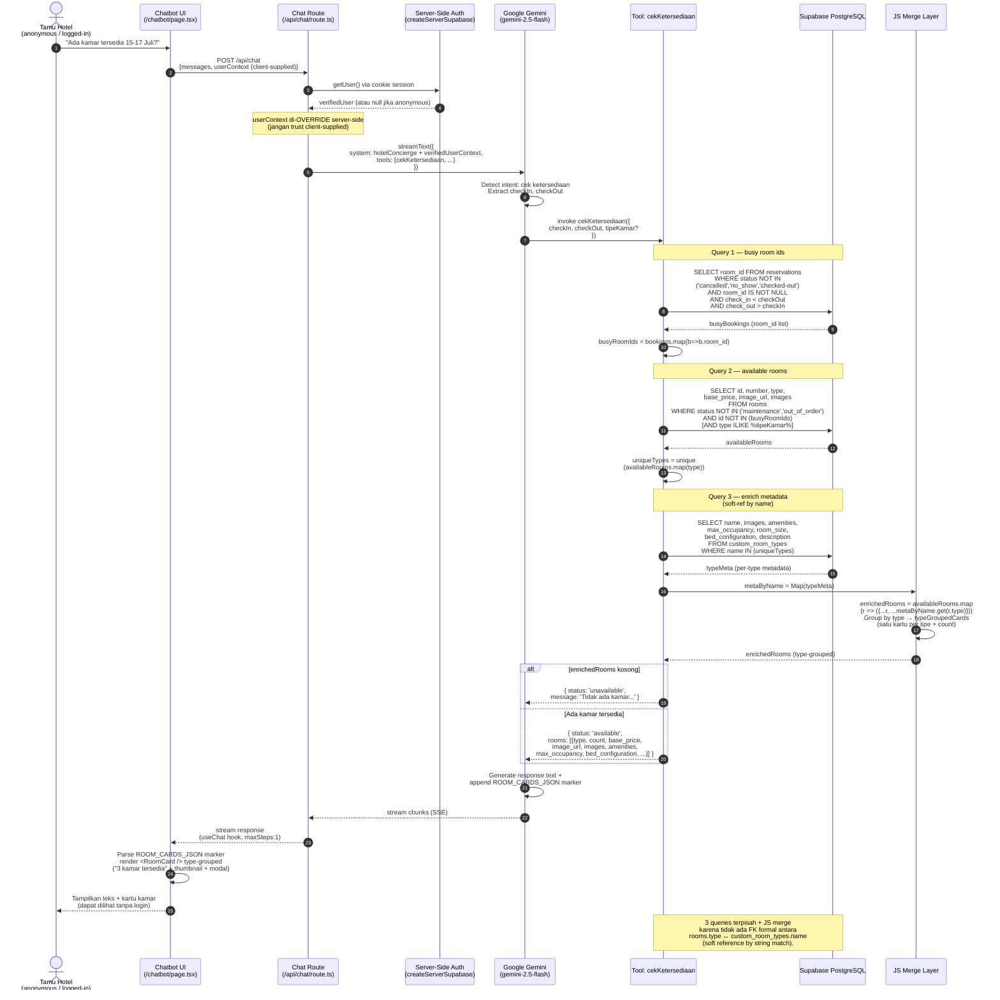
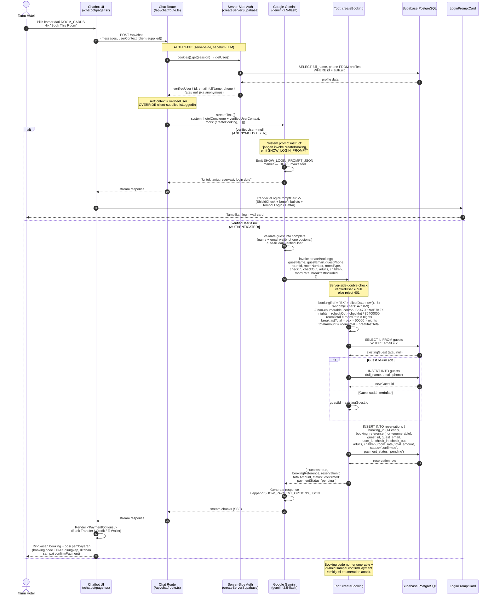
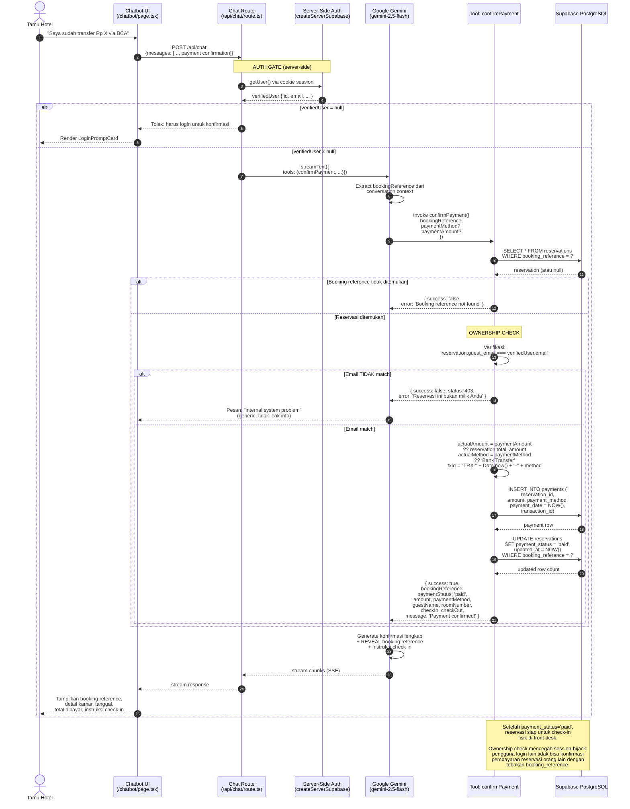
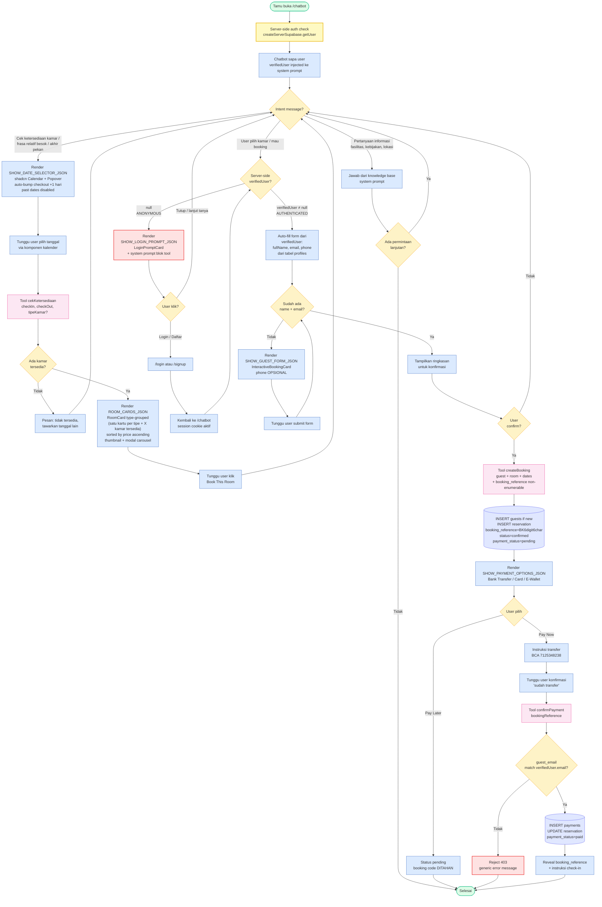
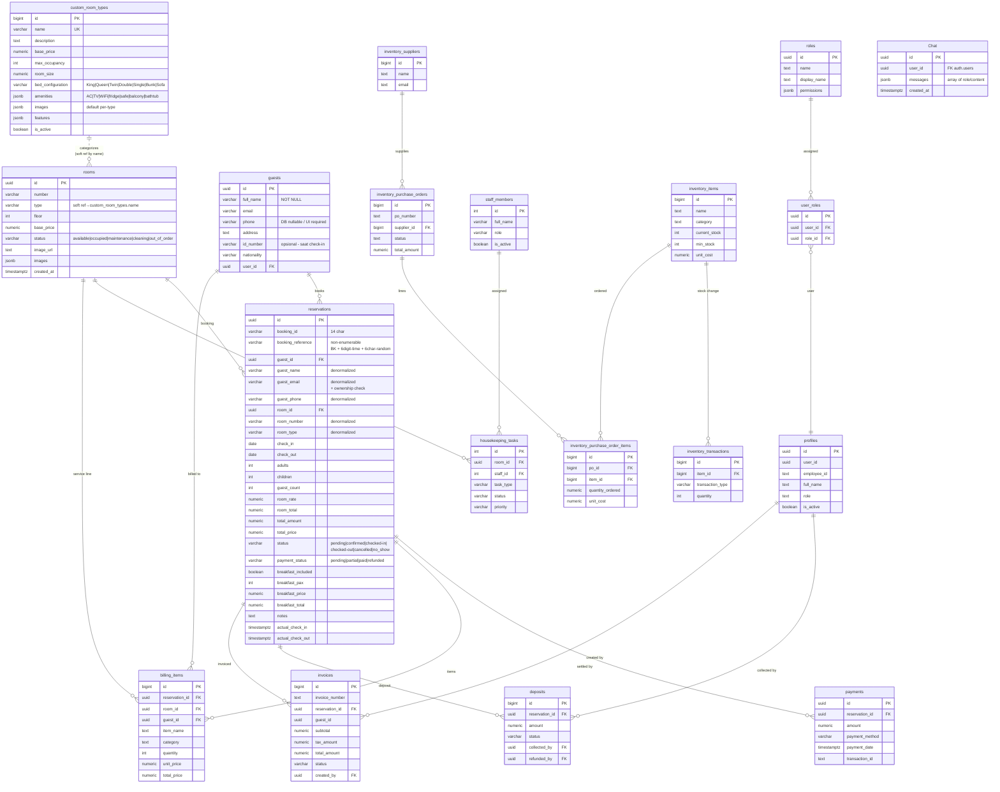

# Asset Generation Guide — StayManager Skripsi

> **Tujuan**: panduan generate / re-generate aset gambar skripsi dengan kualitas HD oleh user (manual), bukan oleh agent.
> **Last sync**: 2026-05-17 (HEAD `5458862` + uncommitted 2026-05-16 chatbot UX overhaul)
> **Konteks**: 6 diagram di `skripsi-assets/diagrams/source/*.mmd` harus di-update karena source code berubah. Yang lain tetap.

---

## 1. Cara render Mermaid → PNG HD

### Opsi A — Web (paling cepat, paling rapi)
1. Buka <https://mermaid.live>
2. Paste Mermaid source dari section di bawah
3. Klik **Actions → PNG** (atau ikon kamera kanan atas)
4. Di settings export: pilih **High resolution** atau set scale 2x/3x
5. Save sebagai `gambar-3-XX.png` di `skripsi-assets/diagrams/png/`

### Opsi B — CLI (untuk batch)
```powershell
# Render single file dengan resolusi tinggi
npx -p @mermaid-js/mermaid-cli mmdc `
  -i skripsi-assets/diagrams/source/gambar-3-07.mmd `
  -o skripsi-assets/diagrams/png/gambar-3-07.png `
  -t neutral `
  -b white `
  -w 1950 `
  -H 1300 `
  --scale 2
```

Catatan flag:
- `-w 1950` — width 1950px (≈ 6.5 inch @ 300dpi); aman untuk Word A4 portrait
- `-H` — height (opsional; biarkan auto kalau sequence diagram panjang)
- `--scale 2` — 2x sharpness (anti-pixelated saat zoom Word)
- `-t neutral` — theme monochrome (sesuai konvensi skripsi)
- `-b white` — background putih solid

### Opsi C — Bulk render semua diagram yang berubah
```powershell
$diagrams = @('3-07','3-08','3-09','3-10','3-17','3-26')
foreach ($d in $diagrams) {
  npx -p @mermaid-js/mermaid-cli mmdc `
    -i "skripsi-assets/diagrams/source/gambar-$d.mmd" `
    -o "skripsi-assets/diagrams/png/gambar-$d.png" `
    -t neutral -b white -w 1950 --scale 2
}
```

---

## 2. Diagram yang HARUS DI-UPDATE (6 diagram)

Source code per 2026-05-16 berubah signifikan. **Replace isi file `.mmd` berikut** dengan Mermaid revisi di bawah, lalu re-render PNG.

### 2.1 `gambar-3-07.mmd` — Sequence: Cek Ketersediaan Kamar

**Yang berubah**: filter status di Query 2 dari `status='available'` jadi `status NOT IN ('maintenance', 'out_of_order')` agar kamar `occupied` tapi free pada tanggal future ikut muncul. Query 1 juga exclude `checked-out` dan null `room_id`.



---

### 2.2 `gambar-3-08.mmd` — Sequence: Create Booking

**Yang berubah**:
- **Server-side auth verification** sekarang menjadi gate UTAMA, bukan sekadar driven by system prompt.
- `userContext.isLoggedIn` di-OVERRIDE server-side via `createServerSupabase().auth.getUser()`.
- Format `booking_reference` non-prediktif: `BK<6-digit-time><6-char-random>` (bukan `BK + Date.now().slice(-8)`).
- Server short-circuit jika tamu anonymous coba `createBooking`.



---

### 2.3 `gambar-3-09.mmd` — Sequence: Konfirmasi Pembayaran

**Yang berubah**: tambah **ownership check** — `reservation.guest_email` harus match `verifiedUser.email`, else reject 403.



---

### 2.4 `gambar-3-10.mmd` — Arsitektur Integrasi LLM Chatbot

**Yang berubah**:
- Tambah **Server-Side Auth Gate** sebelum LLM (createServerSupabase).
- DB: hapus `ai_messages` (kosong, tidak dipakai), hanya `Chat` single-table JSONB.
- Tambah marker `SHOW_LOGIN_PROMPT_JSON` di Cards parser.
- Provider: **Gemini-only** (Groq + Llama dihapus 2026-05-16).

```mermaid
flowchart LR
    subgraph Client["Client Layer (Browser)"]
        UI[Chatbot UI<br/>chatbot/page.tsx<br/>useChat hook + maxSteps:1<br/>+ Stop / Regenerate]
        Cards[Interactive Cards<br/>RoomCard type-grouped<br/>shadcn Calendar + Popover<br/>GuestForm PaymentOptions<br/>LoginPromptCard]
    end

    subgraph NextServer["Next.js Server Runtime"]
        APIRoute["/api/chat/route.ts<br/>POST handler"]
        AuthGate["Server-Side Auth Gate<br/>createServerSupabase<br/>getUser → verifiedUser<br/>OVERRIDE client userContext"]
        AISDK["Vercel AI SDK<br/>ai@4.0.38<br/>streamText, maxSteps:3"]
    end

    subgraph LLM["Google Gemini API (single provider)"]
        Model[gemini-2.5-flash<br/>via @ai-sdk/google 1.0.10]
        FuncCall[Function Calling<br/>Engine]
    end

    subgraph Tools["Tool Definitions (Zod schema)"]
        T1[cekKetersediaan<br/>checkIn checkOut tipeKamar?]
        T2[createBooking<br/>guest + room + dates<br/>requires verifiedUser]
        T3[getRoomTypes<br/>tanpa parameter]
        T4[confirmPayment<br/>bookingReference + method<br/>ownership check guest_email]
    end

    subgraph DB["Supabase PostgreSQL"]
        TR[(rooms)]
        TG[(guests)]
        TRes[(reservations)]
        TP[(payments)]
        TPr[(profiles)]
        TC[(Chat JSONB messages)]
    end

    subgraph SystemPrompt["System Prompt Configuration"]
        SP[Hotel Concierge<br/>Bilingual ID-EN<br/>Date-first booking flow<br/>Pay-now or Pay-later<br/>Booking code hold rule<br/>Auth gate rules]
    end

    User((Tamu Hotel)) -->|Pesan natural language| UI
    UI -->|POST messages + client userContext| APIRoute
    APIRoute -->|cookies session| AuthGate
    AuthGate -->|SELECT profile| TPr
    AuthGate -->|verifiedUser| APIRoute
    APIRoute -->|streamText with verified context| AISDK
    AISDK -->|HTTPS request| Model
    SP -.->|inject| Model

    Model --> FuncCall
    FuncCall -->|Auto-select tool| T1
    FuncCall -->|Auto-select tool| T2
    FuncCall -->|Auto-select tool| T3
    FuncCall -->|Auto-select tool| T4

    T1 -->|SELECT busy + available + meta| TR
    T1 -->|JOIN reservations| TRes
    T2 -->|UPSERT guest| TG
    T2 -->|INSERT reservation<br/>non-enumerable booking_ref| TRes
    T3 -->|SELECT distinct types| TR
    T4 -->|verify guest_email match| TRes
    T4 -->|INSERT payment| TP
    T4 -->|UPDATE reservation| TRes

    T1 -.->|tool result| FuncCall
    T2 -.->|tool result| FuncCall
    T3 -.->|tool result| FuncCall
    T4 -.->|tool result| FuncCall

    FuncCall -->|generate text<br/>+ JSON markers| Model
    Model -->|stream chunks| AISDK
    AISDK -->|SSE response| APIRoute
    APIRoute -->|stream to client| UI

    UI -->|Parse markers<br/>SHOW_GUEST_FORM<br/>ROOM_CARDS (type-grouped)<br/>SHOW_PAYMENT_OPTIONS<br/>SHOW_DATE_SELECTOR<br/>SHOW_LOGIN_PROMPT| Cards
    Cards --> User

    APIRoute -.->|Persist conversation| TC

    classDef clientNode fill:#fef3c7,stroke:#f59e0b
    classDef serverNode fill:#dbeafe,stroke:#3b82f6
    classDef authNode fill:#fee2e2,stroke:#ef4444,stroke-width:2px
    classDef llmNode fill:#fce7f3,stroke:#ec4899
    classDef toolNode fill:#e0e7ff,stroke:#6366f1
    classDef dbNode fill:#dcfce7,stroke:#10b981

    class UI,Cards clientNode
    class APIRoute,AISDK serverNode
    class AuthGate authNode
    class Model,FuncCall,SP llmNode
    class T1,T2,T3,T4 toolNode
    class TR,TG,TRes,TP,TPr,TC dbNode
```

---

### 2.5 `gambar-3-17.mmd` — Activity Diagram: Reservasi via Chatbot

**Yang berubah**:
- **Date-first flow**: SHOW_DATE_SELECTOR (shadcn Calendar + Popover) WAJIB sebelum `cekKetersediaan`, bahkan untuk frasa relatif ("besok", "akhir pekan").
- Auth gate sekarang **server-side enforced**, bukan hanya driven by system prompt.
- Kartu kamar **type-grouped** (satu kartu per tipe + count).



---

### 2.6 `gambar-3-26.mmd` — Entity Relationship Diagram (ERD)

**Yang berubah**:
- Hapus row `ai_messages` (kosong, tidak dipakai produksi) dan relasinya. Konsisten dengan narasi skripsi (LOKASI-5).
- Hapus `pos_transactions` / `pos_transaction_items` (tidak ada di Supabase).
- Tabel `Chat` standalone (tidak FK keluar).



---

## 3. Diagram yang TIDAK BERUBAH

File `.mmd` berikut tetap valid — PNG existing bisa dipakai langsung tanpa re-render:

| File | Deskripsi | Status |
|---|---|---|
| `gambar-1-01.mmd` | Arsitektur Umum PMS (generic) | ✅ tetap |
| `gambar-2-01.mmd` | Arsitektur PMS (layers) | ✅ tetap |
| `gambar-2-02.mmd` | Alur Kerja Scrum (generic) | ✅ tetap |
| `gambar-2-05.mmd` | Contoh Use Case (generic textbook) | ✅ tetap |
| `gambar-2-06.mmd` | Contoh Class Diagram (generic) | ✅ tetap |
| `gambar-2-07.mmd` | Contoh Activity Diagram (generic) | ✅ tetap |
| `gambar-2-08.mmd` | Contoh Sequence Diagram (generic) | ✅ tetap |
| `gambar-3-01.mmd` | Alur Pengembangan Scrum (4 sprints) | ✅ tetap |
| `gambar-3-02.mmd` | Kerangka Berpikir Penelitian | ✅ tetap |
| `gambar-3-03.mmd` | Flowchart Alur Aplikasi | ✅ tetap |
| `gambar-3-04.mmd` | Use Case Diagram StayManager | ✅ tetap (auth gate sudah captured) |
| `gambar-3-05.mmd` | Class Diagram (Domain Entity) | ✅ tetap (sudah pakai ChatSession single-table) |
| `gambar-3-06.mmd` | Sequence Login Staf | ✅ tetap |
| `gambar-3-11.mmd` | Sequence Check-in Tamu | ✅ tetap |
| `gambar-3-12.mmd` | Sequence Check-out Tamu | ✅ tetap |
| `gambar-3-13.mmd` | Sequence Manajemen Kamar | ✅ tetap |
| `gambar-3-14.mmd` | Sequence Manajemen Housekeeping | ✅ tetap |
| `gambar-3-15.mmd` | Activity Login | ✅ tetap |
| `gambar-3-16.mmd` | Activity Registrasi Akun Staff | ✅ tetap |
| `gambar-3-18.mmd` | Activity Check-in Tamu | ✅ tetap |
| `gambar-3-19.mmd` | Activity Housekeeping | ✅ tetap |
| `gambar-3-20.mmd` | Activity Transaksi Keuangan | ✅ tetap |
| `gambar-3-21.mmd` | Antarmuka Halaman Publik | ✅ tetap |
| `gambar-3-22.mmd` | Antarmuka Chatbot LLM | ⚠️ pertimbangkan update untuk reflect type-grouped + Stop/Regenerate (low priority) |
| `gambar-3-23.mmd` | Antarmuka Halaman Login | ✅ tetap |
| `gambar-3-24.mmd` | Antarmuka Manajemen Kamar | ⚠️ pertimbangkan update untuk reflect amenities editor + room detail viewer (low priority) |
| `gambar-3-25.mmd` | Antarmuka Modul Keuangan | ✅ tetap |

---

## 4. Screenshot Bab 4 (manual capture)

Folder output: `skripsi-assets/screenshots/`

### Screenshot existing yang perlu DI-RE-CAPTURE karena ada fitur baru

| File | Halaman | Apa yang harus terlihat (BARU) |
|---|---|---|
| `gambar-4-03.png` | `/rooms` Manajemen Kamar | **Tab Rooms** dengan tabel + thumbnail; pastikan **room detail viewer modal** dibuka (carousel + amenities chip + bed config + size + view type) |
| `gambar-4-10.png` | `/chatbot` Antarmuka Chatbot | Pastikan visible: (a) **shadcn Calendar di Popover** open, (b) **RoomCard type-grouped** dengan "X kamar tersedia", (c) tombol **Stop & Regenerate** dekat input box, (d) typing indicator single persistent |

### Screenshot BARU yang disarankan untuk diambil

| Suggested file | Halaman | Apa yang harus terlihat |
|---|---|---|
| `gambar-4-24.png` (baru) | `/rooms` → edit tipe kamar | **Amenities chip-selector** (AC/TV/WiFi/dll) + **bed config dropdown** (King/Queen/Twin/...) |
| `gambar-4-25.png` (baru) | `/rooms` → klik detail row | **Room detail viewer modal** dengan carousel galeri, spec (kapasitas/luas/bed/view), chip amenitas, deskripsi |
| `gambar-4-26.png` (baru) | `/chatbot` | **Date picker shadcn Calendar** terbuka dalam Popover, dengan past dates di-disable + auto-bump checkout |
| `gambar-4-27.png` (baru) | `/chatbot` | **RoomCard type-grouped**: 3 kartu @1 per tipe dengan label "X kamar tersedia", sorted by price |
| `gambar-4-28.png` (baru) | `/chatbot` saat streaming | Bubble assistant sedang streaming dengan tombol **Stop** visible |
| `gambar-4-29.png` (baru) | `/chatbot` setelah response | Tombol **Regenerate** di assistant message terakhir |

### Spek capture
- Viewport: **1280×800** (desktop default, sesuai konvensi skripsi v3.1)
- Browser: Chrome/Edge in **light mode** (tema aplikasi terang)
- Format: PNG (lossless), bukan JPG
- Disarankan tools: Snipping Tool / ShareX / browser DevTools "Capture full size screenshot"
- Demo accounts (dari `skripsi-assets/.env`):
  - Manager: `demo.manager@hotel-asni.com` / `DemoManager2026!`
  - Guest: `demo.guest@hotel-asni.com` / `DemoGuest2026!`

---

## 5. Anti-patterns & catatan akademis

- **Label Bahasa Indonesia** di seluruh diagram
- **Monochrome** dengan accent biru (`#4472C4`) / abu (`#A5A5A5`), font sans-serif
- **ERD**: `rooms.type` ↔ `custom_room_types.name` = **soft-ref by string**, BUKAN FK formal → digambar putus-putus
- **`Chat` table** = single-table JSONB (capital C, sesuai produksi); `ai_messages` tidak dipakai di kode
- **`id_number`** bukan field reservasi — itu di tabel `guests`, diisi saat check-in fisik
- **`guests.phone`** DB nullable, UI-only required untuk reservasi via chatbot
- **Anonymous user** bisa: browse room types + cek ketersediaan; tidak bisa: createBooking / confirmPayment (server-side blocked)
- **Server-side auth** (createServerSupabase) sekarang mengoverride client-supplied `userContext.isLoggedIn` — pertahankan ini di narasi diagram
- **`booking_reference`** non-enumerable: prefix `BK` + 6-digit timestamp terpangkas + 6-char random (contoh: `BK472019AB7K2X`)

---

## 6. Checklist generate

- [ ] Replace isi 6 file `.mmd` di `skripsi-assets/diagrams/source/` (gambar-3-07, 3-08, 3-09, 3-10, 3-17, 3-26) dengan Mermaid revisi di section 2
- [ ] Re-render PNG ke `skripsi-assets/diagrams/png/` pakai Opsi A (mermaid.live) atau Opsi C (bulk CLI)
- [ ] Re-capture 2 screenshot existing yang berubah: `gambar-4-03.png`, `gambar-4-10.png`
- [ ] Capture 6 screenshot baru opsional untuk fitur baru (`gambar-4-24` s/d `gambar-4-29`)
- [ ] Sisipkan ke Word doc skripsi di posisi placeholder `[GAMBAR BELUM DIINPUT — Gambar X.Y: ...]`

---

*Source-of-truth code references: `src/app/api/chat/route.ts`, `src/app/rooms/page.tsx`, `src/app/chatbot/page.tsx`, `src/components/chatbot/*.tsx`. Untuk audit lengkap, lihat `docs/Skripsi_Audit_Report.md` § "Audit Pass #2 — 2026-05-17".*
