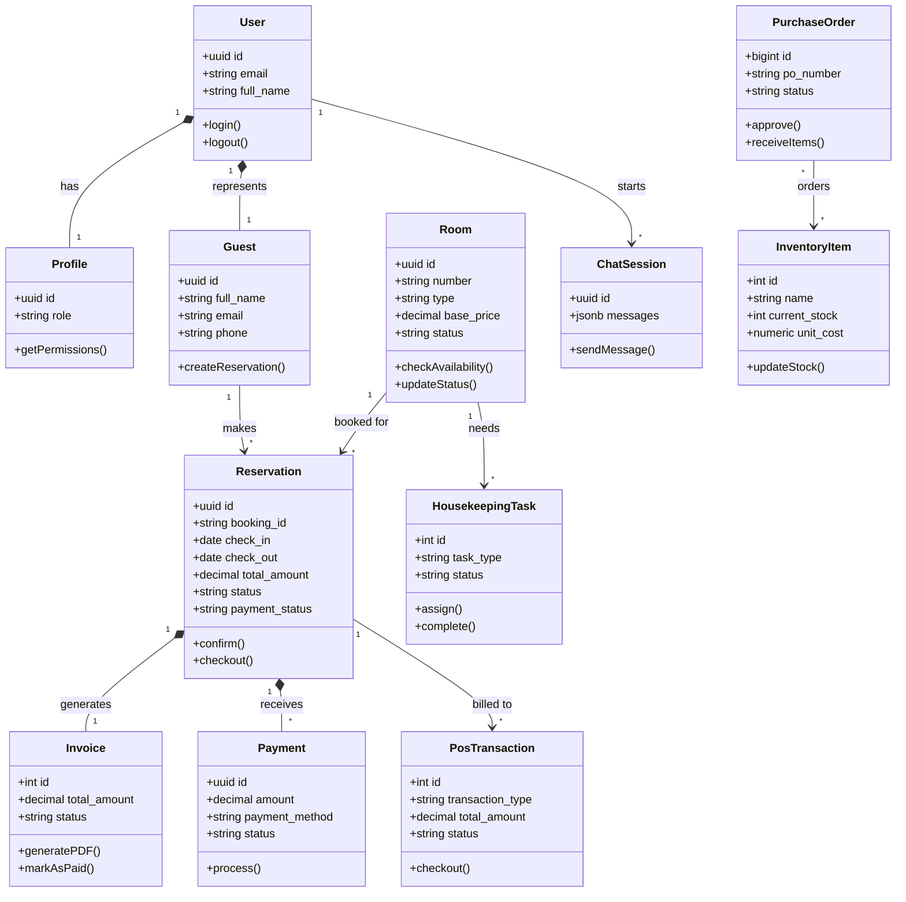
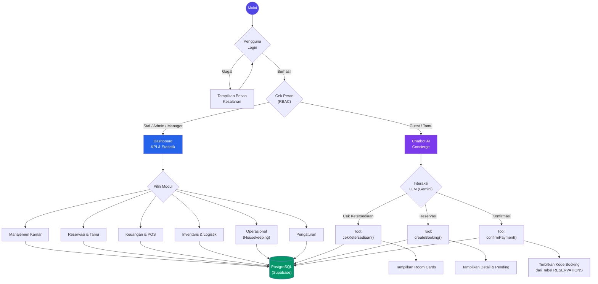
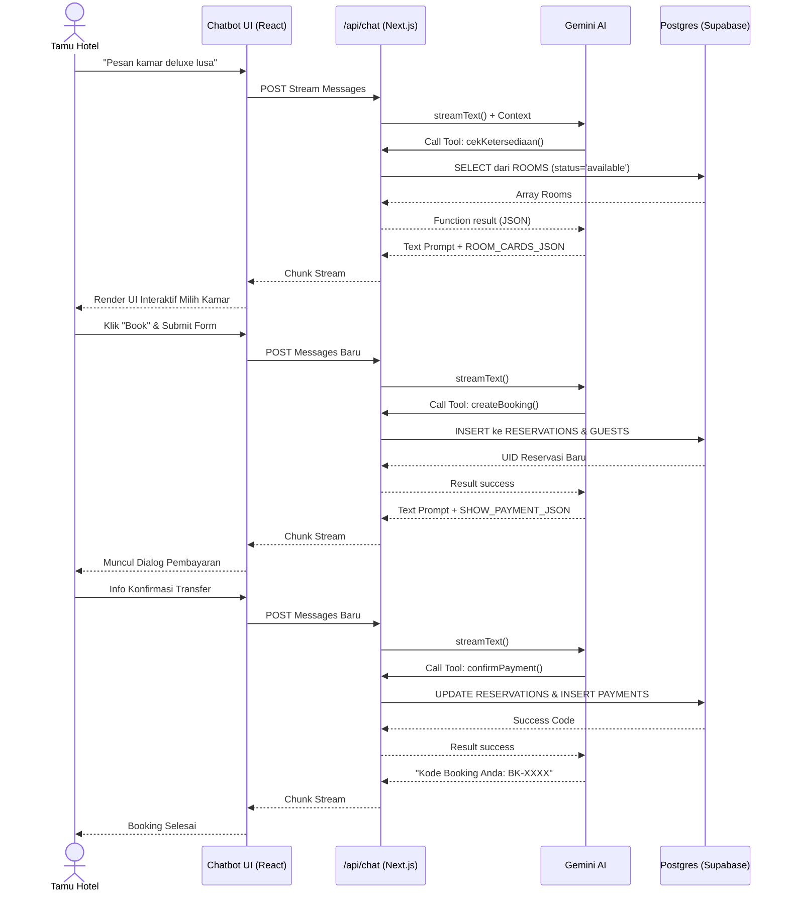

# 📊 Diagram Basis Data & Sistem StayManager (Updated)

File ini berisi kumpulan diagram (ERD, Class Diagram, Use Case, Flowchart) terbaru yang sudah diselaraskan 100% dengan kondisi _database_ Anda setelah pembersihan (hanya berisi tabel-tabel hidup). 

Gunakan kode di bawah ini dengan menyalinnya ke [Mermaid Live Editor](https://mermaid.live) dan *export* sebagai PNG/SVG resolusi tinggi untuk ditempel di dokumen Word/Docs (Skripsi) Anda.

---

## 1. Entity Relationship Diagram (ERD) Final

*(Fokus menampilkan seluruh entitas aktif hasil validasi codebase dan strukutur tabel)*

```mermaid
erDiagram
    USERS {
        uuid id PK
        text email
        text full_name
        timestamp created_at
    }

    PROFILES {
        uuid id PK
        uuid user_id FK
        string full_name
        string role
        string department
    }

    ROLES {
        uuid id PK
        text name
        text display_name
    }

    USER_ROLES {
        uuid id PK
        uuid user_id FK
        uuid role_id FK
    }

    GUESTS {
        uuid id PK
        uuid user_id FK
        string full_name
        string email
        string phone
        string id_number
        text address
        string nationality
    }

    ROOMS {
        uuid id PK
        string number
        string type
        int floor
        decimal base_price
        string status
        string image_url
    }

    CUSTOM_ROOM_TYPES {
        int id PK
        string name
        string description
        decimal base_price
        int max_occupancy
    }

    RESERVATIONS {
        uuid id PK
        string booking_id
        string booking_reference
        uuid guest_id FK
        uuid room_id FK
        date check_in
        date check_out
        int adults
        int children
        decimal total_amount
        string status
        string payment_status
    }

    INVOICES {
        int id PK
        uuid reservation_id FK
        uuid guest_id FK
        decimal subtotal
        decimal total_amount
        string status
        string payment_method
    }

    BILLING_ITEMS {
        int id PK
        uuid reservation_id FK
        uuid room_id FK
        string item_name
        string category
        decimal quantity
        decimal total_price
        string status
    }

    PAYMENTS {
        uuid id PK
        uuid reservation_id FK
        decimal amount
        string payment_method
        string status
        timestamp payment_date
        string transaction_id
    }

    DEPOSITS {
        int id PK
        int reservation_id FK
        decimal amount
        string payment_method
        string status
    }

    EXPENSES {
        int id PK
        date expense_date
        string category
        decimal amount
        text description
        string vendor
        string payment_method
    }

    POS_TRANSACTIONS {
        int id PK
        string transaction_number
        int reservation_id FK
        string transaction_type
        decimal total_amount
        string payment_method
        string status
    }

    POS_TRANSACTION_ITEMS {
        int id PK
        int transaction_id FK
        string item_name
        string category
        numeric quantity
        numeric total_price
    }

    INVENTORY_ITEMS {
        int id PK
        string name
        string category
        int current_stock
        string unit
        numeric unit_cost
        string supplier
    }

    INVENTORY_TRANSACTIONS {
        bigint id PK
        bigint item_id FK
        string transaction_type
        numeric quantity
        numeric unit_cost
    }

    INVENTORY_PURCHASE_ORDERS {
        bigint id PK
        string po_number
        bigint supplier_id FK
        string status
        numeric total_amount
    }

    INVENTORY_PURCHASE_ORDER_ITEMS {
        bigint id PK
        bigint po_id FK
        bigint item_id FK
        numeric quantity_ordered
        numeric total_cost
    }

    INVENTORY_SUPPLIERS {
        bigint id PK
        string name
        string contact_person
        string phone
        string email
    }

    HOUSEKEEPING_TASKS {
        int id PK
        uuid room_id FK
        int staff_id FK
        string task_type
        string title
        string status
        string priority
    }

    GUEST_FACILITY_REQUESTS {
        int id PK
        int guest_id FK
        int reservation_id FK
        int room_id FK
        string service_type
        string status
    }

    GUEST_FACILITY_ITEMS {
        int id PK
        int request_id FK
        string item_name
        int quantity
        numeric total_price
    }

    ROOM_SERVICE_REQUESTS {
        bigint id PK
        string room_number
        string service_type
        string status
    }

    SERVICE_ITEMS {
        int id PK
        string name
        string category
        numeric price
        boolean is_active
    }

    STAFF_MEMBERS {
        int id PK
        string full_name
        string role
        string phone
        boolean is_active
    }

    CHAT {
        uuid id PK
        uuid user_id FK
        jsonb messages
        timestamp created_at
    }
    
    HOTEL_SETTINGS {
        uuid id PK
        text brand_name
        text brand_logo_url
    }

    %% Core Relationships
    USERS ||--|| PROFILES : "has"
    USERS ||--o{ USER_ROLES : "assigned"
    ROLES ||--o{ USER_ROLES : "assigned_to"
    USERS ||--|| GUESTS : "registered_as"
    USERS ||--o{ CHAT : "conducts_session"
    
    GUESTS ||--o{ RESERVATIONS : "makes"
    ROOMS ||--o{ RESERVATIONS : "booked_in"
    CUSTOM_ROOM_TYPES ||--o{ ROOMS : "defines_type"
    
    RESERVATIONS ||--o{ INVOICES : "generates"
    RESERVATIONS ||--o{ BILLING_ITEMS : "contains"
    RESERVATIONS ||--o{ PAYMENTS : "paid_via"
    RESERVATIONS ||--o{ DEPOSITS : "receives"
    
    GUESTS ||--o{ GUEST_FACILITY_REQUESTS : "requests"
    RESERVATIONS ||--o{ GUEST_FACILITY_REQUESTS : "linked_to"
    GUEST_FACILITY_REQUESTS ||--o{ GUEST_FACILITY_ITEMS : "includes"
    
    ROOMS ||--o{ ROOM_SERVICE_REQUESTS : "needs"
    
    RESERVATIONS ||--o{ POS_TRANSACTIONS : "charged_to"
    POS_TRANSACTIONS ||--o{ POS_TRANSACTION_ITEMS : "contains"
    
    ROOMS ||--o{ HOUSEKEEPING_TASKS : "requires"
    STAFF_MEMBERS ||--o{ HOUSEKEEPING_TASKS : "performs"
    
    INVENTORY_ITEMS ||--o{ INVENTORY_TRANSACTIONS : "tracked_event"
    INVENTORY_SUPPLIERS ||--o{ INVENTORY_PURCHASE_ORDERS : "supplies"
    INVENTORY_PURCHASE_ORDERS ||--o{ INVENTORY_PURCHASE_ORDER_ITEMS : "includes"
    INVENTORY_ITEMS ||--o{ INVENTORY_PURCHASE_ORDER_ITEMS : "ordered_as"
```

---

## 2. Class Diagram Final

*(Representasi Entity-OOP yang terhubung pada frontend Next.js)*

---

## 3. Flowchart Aplikasi StayManager

---

## 4. Sequence Diagram — Flow Resolusi API LLM & Database

